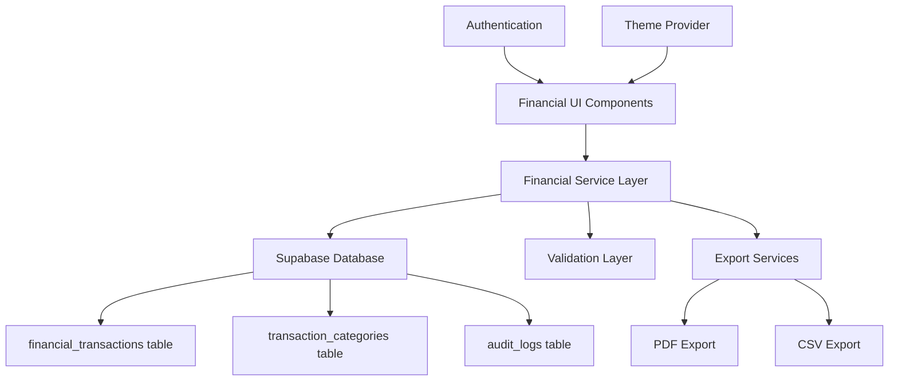
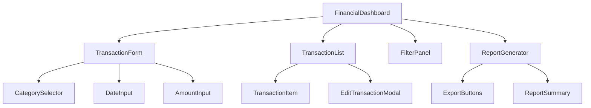

# Design Document: Financial Tracking System

## Overview

The Financial Tracking System is a comprehensive module for recording, managing, and reporting income and expenses within the water meter monitoring application. The system provides administrators with tools to maintain accurate financial records, generate reports, and analyze the financial health of the water management operations.

The design emphasizes data integrity, audit trails, and mobile-responsive interfaces while integrating seamlessly with the existing Next.js application architecture and Supabase backend.

## Architecture

### System Architecture



### Component Hierarchy



## Components and Interfaces

### Core Components

#### 1. FinancialDashboard
Main container component that orchestrates all financial tracking functionality.

**Props Interface:**
```typescript
interface FinancialDashboardProps {
  initialTransactions?: Transaction[];
  userRole: 'admin' | 'user';
}
```

#### 2. TransactionForm
Form component for creating and editing financial transactions.

**Props Interface:**
```typescript
interface TransactionFormProps {
  transaction?: Transaction;
  onSubmit: (transaction: TransactionInput) => Promise<void>;
  onCancel: () => void;
  isEditing?: boolean;
}
```

#### 3. TransactionList
Displays paginated list of transactions with sorting and filtering.

**Props Interface:**
```typescript
interface TransactionListProps {
  transactions: Transaction[];
  onEdit: (transaction: Transaction) => void;
  onDelete: (id: string) => Promise<void>;
  loading?: boolean;
}
```

#### 4. FilterPanel
Provides filtering controls for transactions.

**Props Interface:**
```typescript
interface FilterPanelProps {
  filters: TransactionFilters;
  onFiltersChange: (filters: TransactionFilters) => void;
  categories: TransactionCategory[];
}
```

#### 5. ReportGenerator
Generates and exports financial reports.

**Props Interface:**
```typescript
interface ReportGeneratorProps {
  dateRange: DateRange;
  onDateRangeChange: (range: DateRange) => void;
  onExport: (format: 'pdf' | 'csv') => Promise<void>;
}
```

### Service Layer

#### FinancialService
Centralized service for all financial operations.

```typescript
class FinancialService {
  async createTransaction(transaction: TransactionInput): Promise<Transaction>;
  async updateTransaction(id: string, updates: Partial<TransactionInput>): Promise<Transaction>;
  async deleteTransaction(id: string): Promise<void>;
  async getTransactions(filters?: TransactionFilters): Promise<Transaction[]>;
  async getTransactionById(id: string): Promise<Transaction | null>;
  async getCategories(): Promise<TransactionCategory[]>;
  async generateReport(dateRange: DateRange): Promise<FinancialReport>;
}
```

#### ValidationService
Handles all validation logic for financial data.

```typescript
class ValidationService {
  validateTransaction(transaction: TransactionInput): ValidationResult;
  validateAmount(amount: number): boolean;
  validateDate(date: Date): boolean;
  checkDuplicateTransaction(transaction: TransactionInput): Promise<boolean>;
}
```

## Data Models

### Core Entities

#### Transaction
```typescript
interface Transaction {
  id: string;
  type: 'income' | 'expense';
  amount: number;
  date: Date;
  category_id: string;
  category: TransactionCategory;
  description: string;
  created_at: Date;
  updated_at: Date;
  created_by: string;
  updated_by?: string;
}
```

#### TransactionInput
```typescript
interface TransactionInput {
  type: 'income' | 'expense';
  amount: number;
  date: Date;
  category_id: string;
  description: string;
}
```

#### TransactionCategory
```typescript
interface TransactionCategory {
  id: string;
  name: string;
  type: 'income' | 'expense';
  description?: string;
  is_active: boolean;
  created_at: Date;
}
```

#### TransactionFilters
```typescript
interface TransactionFilters {
  type?: 'income' | 'expense' | 'all';
  category_ids?: string[];
  date_from?: Date;
  date_to?: Date;
  search_term?: string;
  sort_by?: 'date' | 'amount' | 'category';
  sort_order?: 'asc' | 'desc';
  page?: number;
  limit?: number;
}
```

#### FinancialReport
```typescript
interface FinancialReport {
  period: {
    start_date: Date;
    end_date: Date;
  };
  summary: {
    total_income: number;
    total_expenses: number;
    net_profit: number;
  };
  income_by_category: CategorySummary[];
  expenses_by_category: CategorySummary[];
  transactions: Transaction[];
  generated_at: Date;
}
```

#### CategorySummary
```typescript
interface CategorySummary {
  category: TransactionCategory;
  total_amount: number;
  transaction_count: number;
  percentage_of_total: number;
}
```

### Database Schema

#### financial_transactions table
```sql
CREATE TABLE financial_transactions (
  id UUID PRIMARY KEY DEFAULT gen_random_uuid(),
  type VARCHAR(10) NOT NULL CHECK (type IN ('income', 'expense')),
  amount DECIMAL(15,2) NOT NULL CHECK (amount > 0),
  date DATE NOT NULL,
  category_id UUID NOT NULL REFERENCES transaction_categories(id),
  description TEXT NOT NULL,
  created_at TIMESTAMP WITH TIME ZONE DEFAULT NOW(),
  updated_at TIMESTAMP WITH TIME ZONE DEFAULT NOW(),
  created_by TEXT NOT NULL,
  updated_by TEXT
);

CREATE INDEX idx_financial_transactions_date ON financial_transactions(date);
CREATE INDEX idx_financial_transactions_type ON financial_transactions(type);
CREATE INDEX idx_financial_transactions_category ON financial_transactions(category_id);
CREATE INDEX idx_financial_transactions_created_at ON financial_transactions(created_at);
```

#### transaction_categories table
```sql
CREATE TABLE transaction_categories (
  id UUID PRIMARY KEY DEFAULT gen_random_uuid(),
  name VARCHAR(100) NOT NULL,
  type VARCHAR(10) NOT NULL CHECK (type IN ('income', 'expense')),
  description TEXT,
  is_active BOOLEAN DEFAULT true,
  created_at TIMESTAMP WITH TIME ZONE DEFAULT NOW(),
  UNIQUE(name, type)
);
```

#### audit_logs table
```sql
CREATE TABLE audit_logs (
  id UUID PRIMARY KEY DEFAULT gen_random_uuid(),
  table_name VARCHAR(50) NOT NULL,
  record_id UUID NOT NULL,
  action VARCHAR(20) NOT NULL CHECK (action IN ('INSERT', 'UPDATE', 'DELETE')),
  old_values JSONB,
  new_values JSONB,
  user_id TEXT NOT NULL,
  timestamp TIMESTAMP WITH TIME ZONE DEFAULT NOW()
);

CREATE INDEX idx_audit_logs_table_record ON audit_logs(table_name, record_id);
CREATE INDEX idx_audit_logs_timestamp ON audit_logs(timestamp);
```

## Correctness Properties

*A property is a characteristic or behavior that should hold true across all valid executions of a system-essentially, a formal statement about what the system should do. Properties serve as the bridge between human-readable specifications and machine-verifiable correctness guarantees.*

### Property 1: Transaction Creation Consistency
*For any* valid transaction input (income or expense), creating the transaction should result in a database record with all input fields preserved and proper system-generated metadata (id, timestamps, created_by).
**Validates: Requirements 1.1, 2.1**

### Property 2: Required Field Validation
*For any* transaction input missing required fields (amount, date, category, description), the system should reject the transaction and provide clear error messages.
**Validates: Requirements 1.2, 2.2, 6.4**

### Property 3: Amount Validation
*For any* transaction with an invalid amount (negative, zero, or non-numeric), the system should reject the transaction with appropriate error messages.
**Validates: Requirements 1.3, 2.3**

### Property 4: Automatic Timestamping
*For any* successfully created transaction, the system should automatically set created_at timestamp to the current time.
**Validates: Requirements 1.4, 2.4**

### Property 5: Transaction Display Completeness
*For any* transaction in the system, when displayed in the transaction list, all required fields (amount, date, category, description, type) should be visible and properly formatted.
**Validates: Requirements 3.2**

### Property 6: Chronological Ordering
*For any* set of transactions, when displayed without explicit sorting, they should appear in chronological order (newest first).
**Validates: Requirements 3.1**

### Property 7: Transaction Update Preservation
*For any* transaction being edited, all editable fields (amount, date, category, description) should be modifiable while preserving the original id and created_at timestamp.
**Validates: Requirements 3.3**

### Property 8: Currency Formatting Consistency
*For any* monetary amount displayed in the system, it should be formatted using Indonesian Rupiah format (Rp X,XXX.XX).
**Validates: Requirements 3.5, 5.3**

### Property 9: Date Formatting Consistency
*For any* date displayed in the system, it should be formatted using Indonesian format (DD/MM/YYYY).
**Validates: Requirements 3.6, 5.3**

### Property 10: Date Range Filtering
*For any* date range filter applied, only transactions with dates within the specified range (inclusive) should be returned.
**Validates: Requirements 4.1**

### Property 11: Category Filtering
*For any* set of selected categories, only transactions belonging to those categories should be returned.
**Validates: Requirements 4.2**

### Property 12: Type Filtering
*For any* transaction type filter (income/expense), only transactions of that type should be returned.
**Validates: Requirements 4.3**

### Property 13: Description Search
*For any* search term, only transactions containing that term in their description (case-insensitive) should be returned.
**Validates: Requirements 4.4**

### Property 14: Combined Filter Consistency
*For any* combination of filters (date, category, type, search), the results should satisfy all applied filter conditions simultaneously.
**Validates: Requirements 4.5**

### Property 15: Financial Report Calculations
*For any* set of transactions within a date range, the report should correctly calculate total income, total expenses, and net profit/loss (income - expenses).
**Validates: Requirements 5.1**

### Property 16: Category Subtotal Accuracy
*For any* financial report, the sum of all category subtotals should equal the respective total income or total expenses.
**Validates: Requirements 5.2**

### Property 17: Future Date Rejection
*For any* transaction with a date in the future, the system should reject the transaction with an appropriate error message.
**Validates: Requirements 6.3**

### Property 18: Duplicate Detection
*For any* transaction that closely matches an existing transaction (same amount, date, category within a short time window), the system should warn the user before allowing submission.
**Validates: Requirements 6.2**

### Property 19: Audit Trail Completeness
*For any* transaction operation (create, update, delete), the system should create corresponding audit log entries with user information and timestamps.
**Validates: Requirements 6.5**

### Property 20: Error Message Clarity
*For any* validation failure, the system should provide specific, actionable error messages that clearly indicate what needs to be corrected.
**Validates: Requirements 6.1**

## Error Handling

### Validation Errors
- **Client-side validation**: Immediate feedback for form inputs using React Hook Form with Zod schema validation
- **Server-side validation**: Comprehensive validation in Supabase RLS policies and database constraints
- **Error display**: Clear, actionable error messages in Indonesian where appropriate

### Network Errors
- **Connection failures**: Graceful handling with retry mechanisms and offline indicators
- **Timeout handling**: Appropriate timeouts for database operations with user feedback
- **Optimistic updates**: UI updates immediately with rollback on failure

### Data Integrity Errors
- **Constraint violations**: Clear messages for database constraint failures
- **Concurrent modifications**: Handling of simultaneous edits with conflict resolution
- **Audit failures**: Logging and alerting for audit trail issues

### User Experience Errors
- **Permission errors**: Clear messaging when users lack required permissions
- **Session expiry**: Automatic redirect to login with context preservation
- **Form state preservation**: Maintain form data during error recovery

## Testing Strategy

### Dual Testing Approach
The financial tracking system will employ both unit testing and property-based testing to ensure comprehensive coverage and correctness:

- **Unit tests**: Verify specific examples, edge cases, and error conditions
- **Property tests**: Verify universal properties across all inputs using fast-check library
- Both approaches are complementary and necessary for financial system reliability

### Property-Based Testing Configuration
- **Library**: fast-check for TypeScript/JavaScript property-based testing
- **Test iterations**: Minimum 100 iterations per property test for thorough coverage
- **Test tagging**: Each property test tagged with format: **Feature: financial-tracking, Property {number}: {property_text}**
- **Requirements traceability**: Each test references the design document property it validates

### Unit Testing Focus Areas
- **Form validation**: Specific validation scenarios and edge cases
- **Currency formatting**: Indonesian Rupiah formatting edge cases
- **Date handling**: Indonesian date format edge cases and timezone handling
- **Export functionality**: PDF and CSV generation with sample data
- **Error conditions**: Network failures, permission errors, data conflicts

### Property Testing Focus Areas
- **Transaction operations**: Creation, updates, deletion across all valid inputs
- **Filtering and search**: All combinations of filters with randomized data
- **Financial calculations**: Report accuracy across various transaction sets
- **Data integrity**: Audit trails and validation across all operations
- **Formatting consistency**: Currency and date formatting across all displays

### Integration Testing
- **Database operations**: Full CRUD operations with Supabase
- **Authentication flow**: Admin permissions and session management
- **Export workflows**: End-to-end PDF and CSV generation
- **Mobile responsiveness**: Touch interactions and responsive layouts

### Performance Testing
- **Large datasets**: Transaction lists with thousands of records
- **Report generation**: Financial reports with extensive date ranges
- **Concurrent users**: Multiple administrators accessing the system
- **Export performance**: Large report exports in PDF and CSV formats

### Security Testing
- **Input sanitization**: SQL injection and XSS prevention
- **Permission boundaries**: Unauthorized access attempts
- **Audit trail integrity**: Tamper detection and logging verification
- **Data validation**: Malicious input handling and rejection